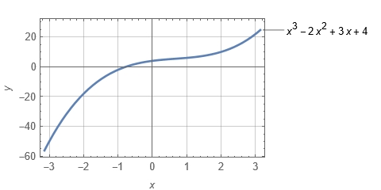

[](https://classroom.github.com/a/4voRty8l)
# **SWO3-Übungen - WS2023/24 - Übungszettel 2**

## **Beispiel 1: Rechnen mit Polynomen**

Ein Polynom $P(x)$ mit $x\in\mathbb{R}$ vom Grad $m\in\mathbb{N}_0$ hat die
allgemeine Form

$$
P(x)=p_0\cdot x^0+p_1\cdot x^1+p_2\cdot x^2+\cdots +p_m\cdot x^m=∑_{i=0}^m p_i\cdot x^i
$$

wobei $p_i\in\mathbb{R}$ mit $0\leq i\leq m$ die jeweiligen Koeffizienten der
Potenzen von $x$ sind. Ein Polynom vom Grad $m$ kann als C-Array der Länge
$m+1$, welches die Werte der Koeffizienten aufnimmt, dargestellt werden.

Implementieren Sie ein C17-Programm `polynomial`, das die
folgenden Funktionalitäten enthält:

<br>

**a)** Schreiben Sie eine Funktion `poly_print`, die ein Polynom auf der Konsole
(am Bildschirm) ausgibt. Die Schnittstelle von `poly_print` muss wie folgt
aussehen:

```C
void poly_print (double const p [], int const m);
```

*Ein Beispiel:* Für das Polynom $P(x)=4+3\cdot x-2\cdot x^2+x^3$ muss
`poly_print` folgendes ausgeben:

```cmd
4 + 3*x - 2*x^2 + x^3
```

<br>

**b)** Schreiben Sie eine Funktion `poly_evaluate`, die ein Polynom an einer
gegebenen Stelle $x\in\mathbb{R}$ ausrechnet. Die Schnittstelle von
`poly_evaluate` muss wie folgt aussehen:

```C
double poly_evaluate (double const p [], int const m, double const x);
```

*Ein Beispiel:* Für obiges Polynom ergibt sich ein ungefährer Wert von 7.375,
wenn man es an der Stelle 1.5 auswertet:



<br>

**c)** Schreiben Sie eine Funktion `poly_add`, die zwei Polynome summiert. Die
beiden Polynome $P(x)$ vom Grad $m$ und $Q(x)$ vom Grad $n$ werden summiert,
indem deren Koeffizienten paarweise addiert werden:

$$
P(x)+Q(x)=∑_{i=0}^{max(m,n)}(p_i+q_i)\cdot x^i
$$

Der Grad des resultierenden Polynoms wird von `poly_add` als Funktionswert
retourniert. Die Schnittstelle von `poly_add` muss wie folgt aussehen:

```C
int poly_add (
   double const p [], int const m,   // Polynom P(x) vom Grad m
   double const q [], int const n,   // Polynom Q(x) vom Grad n
   double       r []                 // Polynom R(x) vom Grad max (m, n)
);
```

*Ein Beispiel:* Seien

$P(x)=1+x+3\cdot x^2-4\cdot x^3$ und<br>
$Q(x)=1+2\cdot x-5\cdot x^2-3\cdot x^3-2\cdot x^5$.

Dann berechnet sich das Polynom $R(x)=P(x)+Q(x)$ zu

$R(x)=2+3\cdot x-2\cdot x^2-7\cdot x^3-2\cdot x^5$.

<br>

**d)** Schreiben Sie eine Funktion `poly_mult`, die zwei Polynome miteinander
multipliziert. Die beiden Polynome $P(x)$ vom Grad $m$ und $Q(x)$ vom Grad $n$
werden miteinander multipliziert, indem jeder Koeffizient des einen Polynoms mit
jeweils allen Koeffizienten des anderen Polynoms multipliziert wird:

$$
P(x)\cdot Q(x)=∑_{i=0}^m∑_{j=0}^n p_i\cdot q_j\cdot x^{i+j}
$$

Ein Algorithmus, der nach diesem Schema arbeitet, besitzt bezüglich der Anzahl
der Multiplikationen eine asymptotische Laufzeitkomplexität von $O(n^2)$. Der
Grad des resultierenden Polynoms wird von `poly_mult` als Funktionswert
retourniert. Die Schnittstelle von `poly_mult` muss wie folgt aussehen:

```C
int poly_mult (
   double const p [], int const m,   // Polynom P(x) vom Grad m
   double const q [], int const n,   // Polynom Q(x) vom Grad n
   double       r []                 // Polynom R(x) vom Grad m + n
);
```

*Ein Beispiel:* Seien wiederum

$P(x)=1+x+3\cdot x^2-4\cdot x^3$ und<br>
$Q(x)=1+2\cdot x-5\cdot x^2-3\cdot x^3-2\cdot x^5$.

Dann berechnet sich das Polynom $R(x)=P(x)\cdot Q(x)$ zu

$R(x)=1+3\cdot x-6\cdot x^3-26\cdot x^4+9\cdot x^5+10\cdot x^6-6\cdot x^7+8\cdot x^8$.

<br>

**e)** Schreiben Sie eine Funktion `poly_mult_fast`, die so wie `poly_mult` zwei
Polynome miteinander multipliziert, diesmal aber in $O\bigl(n^{\log_2 3}\bigr)$.
(*Hinweis:* $\log_2 3\approx 1.585$) Erreicht wird dies, indem der geforderte
Algorithmus nach dem Teile-und-Herrsche-Prinzip arbeitet.

Für Ihre Implementierung von `poly_mult_fast` dürfen Sie annehmen, dass beide
Polynome vom selben Grad $m\in\mathbb{N}$ sind und dass $m+1$ eine Zweierpotenz
ist, dass also $m+1=2^k$ mit $k\in\mathbb{N}$ gilt. Ihre Implementierung von
`poly_mult_fast` muss diese beiden Invarianten (z.B. mit `assert`) überprüfen
und bei deren Verletzung entsprechend reagieren.

Ein Teil der algorithmischen Teile-und-Herrsche-Idee ist der, dass man die zu
multiplizierenden Polynome $P(x)$ und $Q(x)$ in jeweils zwei gleich große
Hälften aufteilt:

$P_L(x)=p_0+p_1\cdot x+\cdots +p_\frac{m}{2}\cdot x^\frac{m}{2}$ und<br>
$P_R(x)=p_{\frac{m}{2}+1}+p_{\frac{m}{2}+2}\cdot x+\cdots +p_m\cdot x^\frac{m}{2}$

sowie

$Q_L(x)=q_0+q_1\cdot x+\cdots +q_\frac{m}{2}\cdot x^\frac{m}{2}$ und<br>
$Q_R(x)=q_{\frac{m}{2}+1}+q_{\frac{m}{2}+2}\cdot x+\cdots +q_m\cdot x^\frac{m}{2}$.

Das Produkt $P(x)\cdot Q(x)$ kann nun auf die folgende Art berechnet werden:

$P(x)\cdot Q(x)=P_L(x)\cdot Q_L(x)+\bigl(P_L(x)\cdot Q_R(x)+P_R(x)\cdot Q_L(x)\bigr)\cdot x^{\frac{m}{2}+1}+P_R(x)\cdot Q_R(x)\cdot x^{m+1}$

Aber das alleine bringt noch nicht den gewünschten Geschwindigkeitsgewinn. Es
müssen nämlich vier Polynommultiplikationen von Polynomen von zwar halber Länge
gemacht werden, aber es gilt trotzdem $4\cdot
O\bigl(\frac{n^2}{2}\bigr)=O(n^2)$. Eine Verbesserung ergibt sich erst dann,
wenn man noch zusätzlich die drei Hilfsvariablen

$H_L(x)=P_L(x)\cdot Q_L(x)$,<br>
$H_R(x)=P_R(x)\cdot Q_R(x)$ und<br>
$H_M(x)=\bigl(P_L(x)+P_R(x)\bigr)\cdot \bigl(Q_L(x)+Q_R(x)\bigr)$

einführt und mit deren Hilfe das geforderte Produkt berechnet:

$P(x)\cdot Q(x)=H_L(x)+\bigr(H_M(x)-H_L(x)-H_R(x)\bigr)\cdot x^{\frac{m}{2}+1}+H_R(x)\cdot x^{m+1}$.

Damit reduziert sich die Anzahl der Polynommultiplikationen von vier auf drei
und die asymptotische Laufzeitkomplexität sinkt von $O(n^2)$ auf $O(n^{1.585})$.

*Ein Beispiel:* Seien

$P(x)=1+x+3\cdot x^2-4\cdot x^3$ und<br>
$Q(x)=1+2\cdot x-5\cdot x^2-3\cdot x^3$

und damit

$P_L(x)=1+x$,<br>
$P_R(x)=3-4\cdot x$,<br>
$Q_L(x)=1+2\cdot x$ und<br>
$Q_R(x)=-5-3\cdot x$

sowie

$H_L(x)=1+3\cdot x+2\cdot x^2$,<br>
$H_R(x)=-15+11\cdot x+12\cdot x^2$ und<br>
$H_M(x)=-16+8\cdot x+3\cdot x^2$.

Dann berechnet sich das Polynom $R(x)=P(x)\cdot Q(x)$ zu

$R(x)=1+3\cdot x-6\cdot x^3-26\cdot x^4+11\cdot x^5+12\cdot x^6$.

Die Schnittstelle von `poly_mult_fast` muss wie folgt aussehen:

```C
int poly_mult_fast (
   double const p [], int const m,   // Polynom P(x) vom Grad m
   double const q [], int const n,   // Polynom Q(x) vom Grad n == m
   double       r []                 // Polynom R(x) vom Grad 2 * m
);
```

Der Grad des resultierenden Polynoms wird von `poly_mult_fast` als Funktionswert
retourniert.

*Anmerkung:* C-Arrays zum Speichern von Polynomen müssen statisch allokiert
werden. Definieren Sie diesbezüglich in Ihrem Programm eine Konstante, die eine
Maximalgröße für Polynome darstellt. Wo es möglich und sinnvoll ist, müssen zur
Laufzeit Polynome vor dem Überschreiten dieser Maximalgröße geschützt werden.
